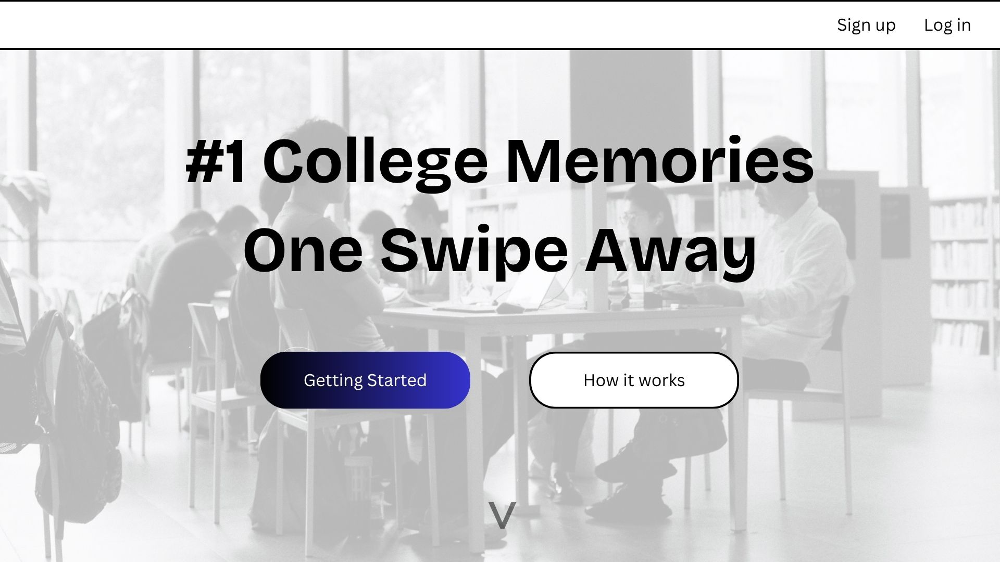
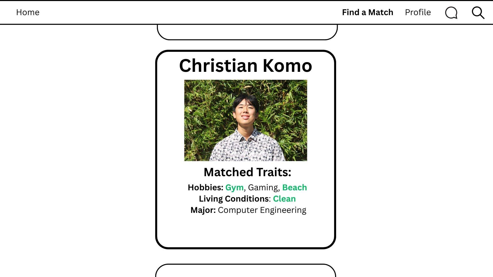
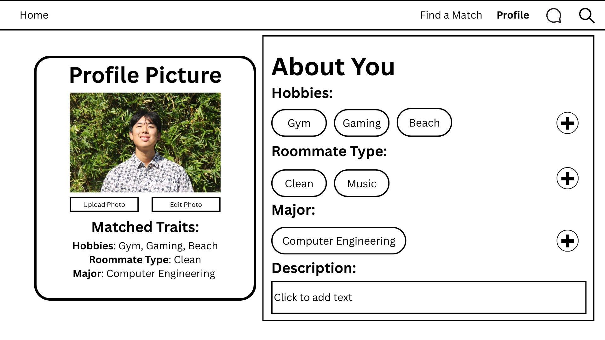
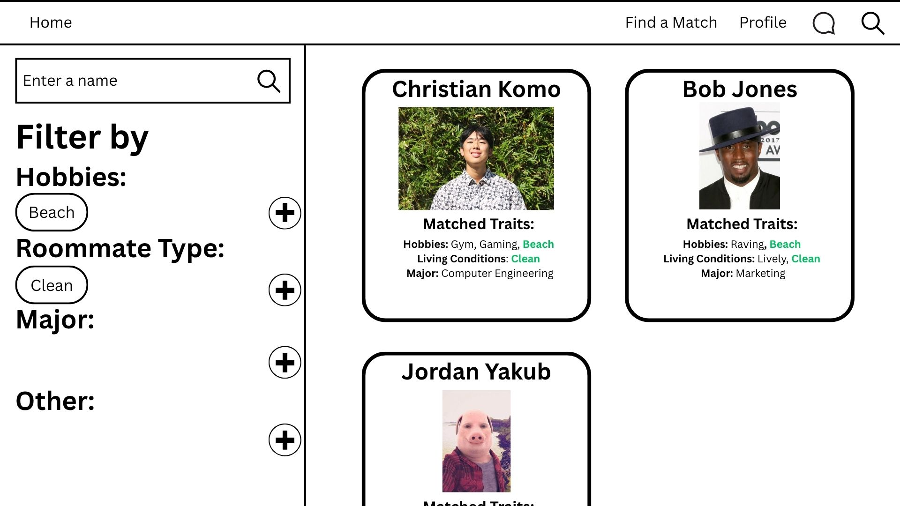

# Roomie Match Manoa
*A roommate matching web application for UH Mānoa students.*

## Table of Contents
* [Overview](#overview)
* [System Objectives and Features](#system-objectives-and-features)

## Overview
The goal of Roomie Match Manoa is to create a user-friendly web application that helps students at the University of Hawaiʻi at Mānoa connect with compatible roommates. The platform aims to simplify the process of finding suitable living arrangements by matching students based on shared preferences, lifestyle habits, and housing interests. By providing an accessible and secure environment for students to interact and form connections, Roomie Match Manoa seeks to improve the overall campus living experience and promote positive roommate relationships.

## System Objectives and Features
The web application will eventually provide the following functionalities:

1. **User Accounts and Profiles**
   - Students can create personal accounts using their university email and build detailed profiles.
   - Profiles include details such as major, interests, and lifestyle preferences.
   - Users can update profiles at any time.
1. **Roommate Matching Algorithm**
   - The system will analyze user-inputted preferences and suggest compatible matches.
     - Potential features the algorithm may take into account are: shared lifestyle preferences, study and sleep habits, major, etc.
1. **Search and Filter Options**
   - Users can search for roommates manually using filters such as major, housing type, or gender preference.
   - Filtered results help users explore beyond automatic matches.
1. **Messaging and Connection Tools**
   - Once matched, users can communicate through an in-app chat feature.
   - Connection requests and message notifications help users stay engaged.
1. **Privacy and Safety Controls**
   - Users can choose what personal details are visible to others.
   - Moderation and reporting features ensure safe interactions.
1. **Responsive and Accessible Design**
   - The platform is optimized for both desktop and mobile use.
   - Accessibility features ensure inclusivity for all students.
1. **Chatbot Assistant**
   - An integrated chatbot will guide users through profile setup and matching.
   - The chatbot will answer FAQs and help users navigate the platform efficiently.

## Mockup Pages

Landing page for application.

Matching page to find roomates. Matching algorithm used to find the most compatible matches, with public biographies displaying roommate information.

Edit profile page. Students can change their bio based on personality traits.

Search page. Students can search for other roomates based on quailities.